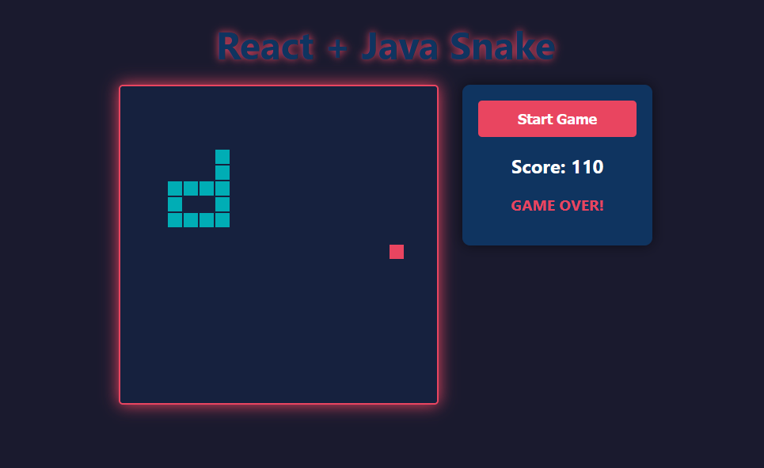

# 🐍 Full-Stack Server-Authoritative Snake Game

A decoupled, full-stack implementation of the classic Snake game. This project demonstrates a **Server-Authoritative Architecture**, where the React frontend acts solely as a view layer, and all game logic, physics, and state management are handled by a high-performance, multithreaded Java backend.



## 🧠 Engineering Architecture

Unlike traditional browser games where logic runs in JavaScript, this project treats the browser as a "dumb terminal."

*   **Server-Authoritative:** The Java backend controls the "Source of Truth." It calculates collision, movement, and score. This prevents client-side cheating (e.g., modifying the score variable in the browser console).
*   **Microservice Pattern:** The Frontend and Backend are completely decoupled, communicating strictly via a RESTful JSON API.
*   **Zero-Dependency Backend:** The server is built **entirely from scratch** using the standard JDK (`com.sun.net.httpserver`). No Spring Boot, no Jakarta EE—just pure Java.
*   **Concurrency:** The application runs two parallel execution contexts:
    1.  **The Game Loop:** A high-frequency background thread calculating game physics.
    2.  **The HTTP Server:** A separate thread pool handling incoming API requests.
    *   *Thread safety is ensured using `volatile` keywords and `CopyOnWriteArrayList`.*

## 🚀 Tech Stack

### Backend (API & Engine)
*   **Language:** Java 17+
*   **Library:** `com.sun.net.httpserver` (Standard JDK)
*   **Concepts:** Multithreading, REST API, JSON Serialization, CORS Configuration

### Frontend (Client)
*   **Framework:** React.js (Vite)
*   **Rendering:** HTML5 Canvas API (High performance 2D rendering)
*   **State Management:** React Hooks (`useEffect`, `useRef`, `useState`)
*   **Styling:** CSS3 (Neon/Dark Mode)

## 🛠️ Installation & Running Locally

This project is a monorepo. You will need to run the backend and frontend in separate terminal windows.

### Prerequisites
*   Java Development Kit (JDK) 17 or higher
*   Node.js & npm

### 1. Clone the Repository
```bash
git clone https://github.com/YOUR_USERNAME/YOUR_REPO_NAME.git
cd YOUR_REPO_NAME
```

### 2. Start the Java Backend
The backend uses a package structure (`backend`). Run these commands from the **root** directory:

```bash
# Compile the Java files
javac backend/*.java

# Run the Server (Note the dot separator)
java backend.GameServer
```
*You should see: `Game server started on port 8080`*

### 3. Start the React Frontend
Open a **new terminal window**, navigate to the frontend, and start Vite:

```bash
cd frontend
npm install
npm run dev
```
*Open your browser to `http://localhost:5173` to play!*

## 🔌 API Reference

The React frontend communicates with Java via these endpoints:

| Method | Endpoint | Description |
| :--- | :--- | :--- |
| `POST` | `/api/start` | Resets the game state, score, and snake position. |
| `POST` | `/api/input` | Sends direction (`UP`, `DOWN`, `LEFT`, `RIGHT`) to the engine. |
| `GET` | `/api/state` | Returns the current game frame (Snake body, Food, Score, GameOver status). |

## 🔮 Future Improvements
*   **WebSockets:** Upgrade the HTTP Polling mechanism to `java.net.http.WebSocket` for bi-directional, lower-latency communication.
*   **Database:** Integrate PostgreSQL to save high scores persistently.
*   **Multiplayer:** Implement a lobby system to allow multiple snake instances on the same grid.

## 📄 License
MIT License

---

### 💡 Portfolio Tip
**Take a screenshot of your game!**
1. Run the game.
2. Take a screenshot (Windows: `Win+Shift+S`, Mac: `Cmd+Shift+4`).
3. Drag that image into your GitHub repository file list to upload it.
4. Click on the uploaded image to get its URL.
5. Replace the `via.placeholder.com` link in the README above with your actual image URL.

This makes the repo look 10x more professional immediately.